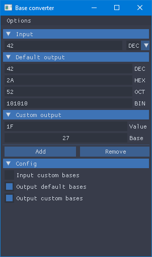

# BaseConverter

Number base converter, example / test of [Dear ImGui](https://github.com/ocornut/imgui) + [ImGui-SFML](https://github.com/eliasdaler/imgui-sfml) + [SFML](https://github.com/SFML/SFML)

## Dependencies

BaseConverter uses [Dear ImGui](https://github.com/ocornut/imgui), [ImGui-SFML](https://github.com/eliasdaler/imgui-sfml) and [SFML](https://github.com/SFML/SFML), the repositories of these projects are present as git submodules and compiled with the application.

Only SFML have [additional dependencies](https://www.sfml-dev.org/faq.php#grl-dependencies) but they are provided directly on Windows and Mac OS X.

On Linux, SFML relies on your own installation of the libraries it depends on. You must have the development files of the following libraries installed before compiling SFML:
- pthread
- opengl
- xlib
- xrandr
- udev
- freetype
- jpeg
- openal
- flac
- vorbis

## Build

To build the project you need a C++11 compliant compiler.

A *CMakeLists.txt* is available, see [Running CMake](https://cmake.org/runningcmake/) for more information.

On linux, the common CMake use is:

	$ mkdir build
	$ cd build
	$ cmake ..
	$ make

On Windows, there is batch files available to configure Visual Studio project in the ``ide`` folder.

## Preview

## Copyright

This work is under the MIT License

[Read the license file](LICENSE)
